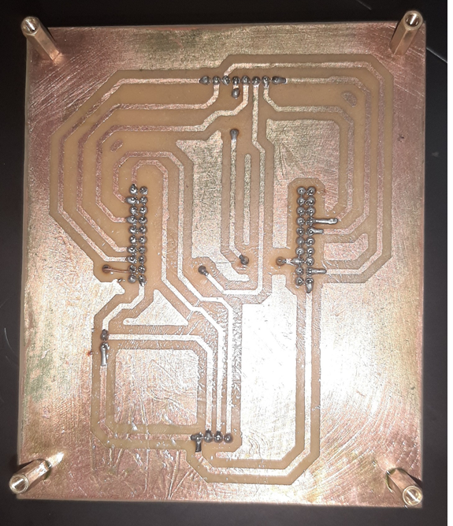
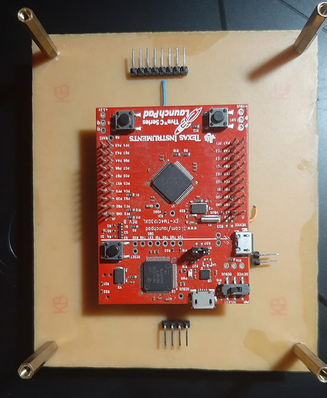
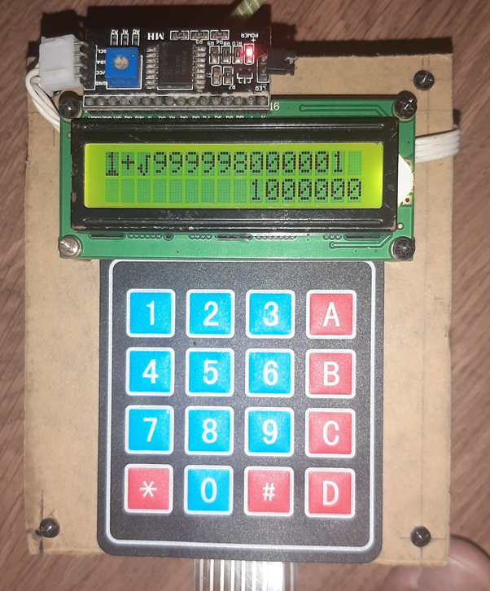
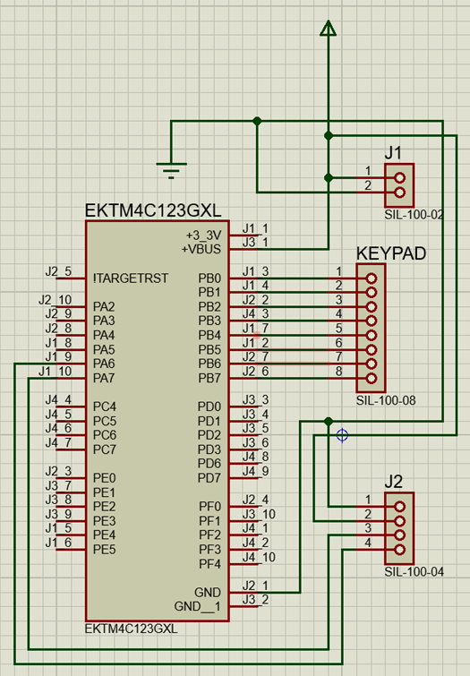
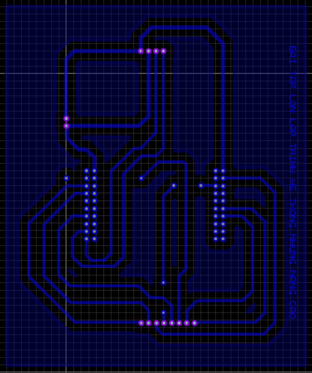

# Access Control System (ACS)

## Overview
This project uses the Tiva C EK-TM4C123GXL board to build a RTOS-based Simple Caculator. The firmware uses [FreeRTOS](https://www.freertos.org/), and is an example of a soft real-time system.

This project focuses on using freeRTOS and the techniques surrounding it to create a simple caculator.
The system includes 3 main tasks 'display', 'button', 'main' and are synchronized to perform sequentially together, processing inputs and producing the output that the user needs using 2 main techniques: semaphore and message. queue. queue.
Some key functions that computers can perform: +, -, *, :, ^, sin, cos, log, sqrt, . (decimal point), x (solve quadratic equation), AC (reset), DEL (delete character), UP, DOWN, RIGHT, LEFT.

This project was designed by me, in the AESP subject. From HCMUT with love, peace!

## Images

### RTOS-based Simple Caculator

### Circuit Diagram

### PCB

### System Specification Diagram

### Task Diagram

### FSM Diagram

